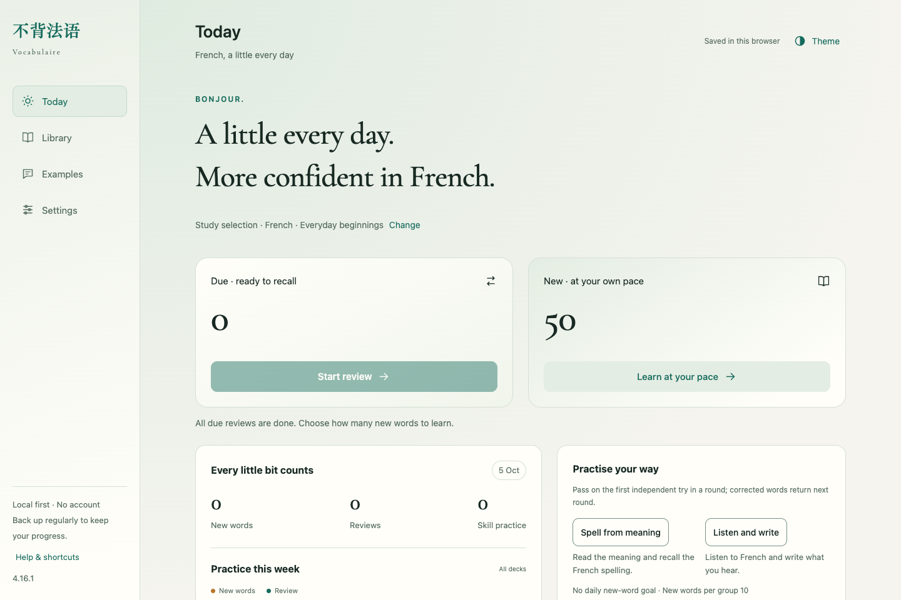
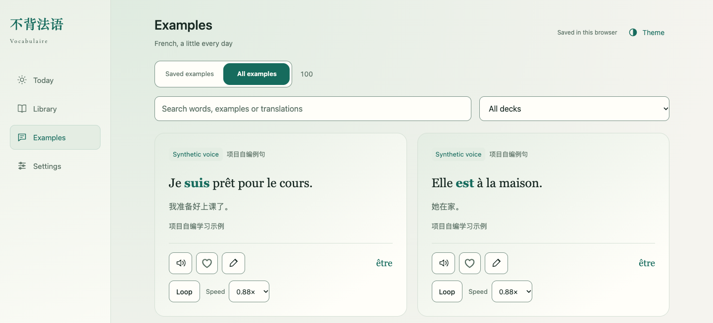
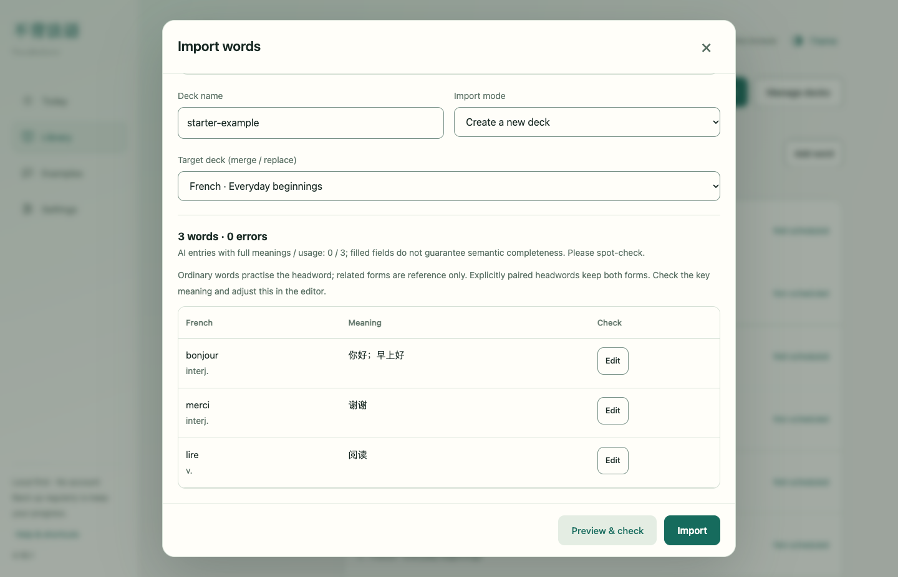
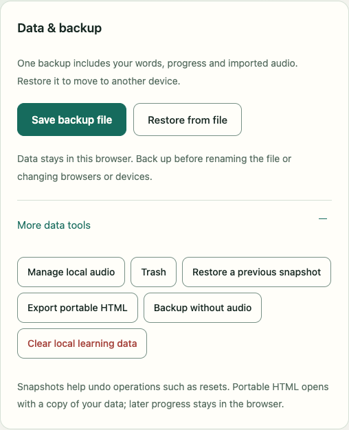

# 不背法语 · Vocabulaire

As many of you know, 不背单词 is a great app for learning English vocabulary. Its clean, elegant UI and science-based, efficient learning system make it a pleasure to use.

But when I was learning French, I couldn't find a French vocabulary app as well designed as 不背单词. So, I used Codex to build this French version of the app from scratch — a website passionately crafted over dozens of iterations, utilizing GPT-6 Astra and consuming over a billion tokens.

One of the things that makes this website special is that everything lives in a single HTML file. All your data is stored locally, so you can use it anytime, anywhere, without signing up or connecting to the internet.

I hope this website helps you remember French words more efficiently!

[](https://github.com/lingyunleo/bubei-French) [](CHANGELOG.md) [](PRIVACY.md) [](CONTRIBUTING.md) [](README.md) [](README.en.md)



## Getting started

1. Download the HTML file from the latest release: [不背法语-4.16.3.html](https://github.com/lingyunleo/bubei-French/releases/download/v4.16.3/bubei-French-4.16.3.html).
2. Open the file in a common browser, such as Google Chrome, Safari, Microsoft Edge, or Firefox.
3. Follow the onboarding guide to try out the features and make it your own. Then you're ready to start learning!


## Features

- Learn new words in groups, schedule reviews with FSRS, and practise spelling, dictation, and words you got wrong.
- Mark familiar words as known to exclude them from future study and practice. Unmark them in the library to restore their previous progress. Marking words as known does not count as actual practice.
- Manage multiple word lists. Import Excel, CSV, or TSV files, or paste tabular text directly.
- Import example sentences and translations, use your browser's text-to-speech, or add recordings you have permission to use.
- Choose a Chinese, English, or French interface, with three styles—CLASSIQUE, ATELIER, and VERDURE—each available in light and dark modes.
- Export word lists, a complete learning backup, or a portable HTML file containing your current data.


The starter content includes 50 common words and 100 example sentences. Of these, 99 examples were written for the project and use text-to-speech, and 1 is a built-in short sentence with a human recording, source information, and a license. These starter examples are intended only for trying out the features.



## Importing word lists

Open “Import words” in the Library, then choose your prepared file or paste the table contents. Check the entries, meanings, and messages in the preview before confirming the import.



You can directly import a raw CSV exported by 法语助手, but a direct import only extracts the first meaning. It does not automatically generate full usage notes or example sentences.

The page provides a prompt for having AI organise your word list. You can give the prompt and your word list file—which can be an image, spreadsheet, PDF, or another common format—to an AI and ask it to produce an importable file. You'll still need to check the AI-generated results yourself.

You can try the import feature with the [three-word TSV example](examples/入门示例.tsv).

Supported import formats are `.xlsx`, `.xls`, `.ods`, `.csv`, `.tsv`, and `.txt`. A TSV with headers such as “法语” (“French”) and “中文” (“Chinese”) is usually recommended, as tab-separated fields work well for preserving long meanings and example sentences. The word list file size limit is 12 MB.

## Saving, backups, and upgrades

Normally, your word lists, progress, settings, and imported audio are saved in the current browser. They are not automatically written back to the original HTML file or synced to other devices. If the page says it cannot save your data persistently, export a backup promptly.

Use **Settings → Data & backup → Save backup file** to export a complete backup. It's a good idea to do this before changing devices or browsers, moving the file, upgrading, or clearing browser data.



To upgrade, first export a backup from the old file. Then open the new version and use “Restore from file” to check the contents and confirm. **Restoring replaces the target page's library and progress; it does not automatically merge two sets of saved data.** An ordinary CSV/TSV word list does not include your full learning progress and cannot replace a JSON backup.

Browsers may isolate storage for local files differently. If your old data no longer appears after renaming or moving a file, that does not necessarily mean it has been deleted. You can return to the original file location and browser, export a backup, and then move your data to the new version.

Files created with “Export portable HTML” and complete JSON backups may contain your word lists, notes, learning history, and recordings. Treat them as personal data. See the [Privacy notice](PRIVACY.md) for details.

## Offline use and sound

Once downloaded, the release HTML file can be opened offline for text-based study. The built-in human voice sample and recordings already saved locally can also be played offline.

Browser text-to-speech depends on your device, French voice packs, browser permissions, and chosen voice; some voices may need an internet connection. Online audio that has not yet been cached also needs an internet connection, and its source may restrict access. This means not all sounds are guaranteed to work offline. If playback fails, check your French voice settings, try playing it again, or continue studying with text.

## Local development

You'll need **Python 3.9+**, **Node.js 22+**, and npm. For the first setup, run these commands in order:

```sh
git clone https://github.com/lingyunleo/bubei-French.git
cd bubei-French
npm ci
npx playwright install chromium webkit
npm run build
npm test
npm run test:browser
```

If your Linux environment is missing system dependencies for the browsers, use `npx playwright install --with-deps chromium webkit`.

`npm run build` calls `scripts/build-release.py` to generate a single HTML file in the repository root, using the version in `release.json`. Rebuild after changing the source; direct edits to the generated HTML will be overwritten by the next build. Test commands must actually be run. Listing them here does not mean that your environment or any particular commit has passed the checks.

```text
src/                       Pages, styles, learning logic, and local dependencies
src/vendor/                Third-party libraries, licenses, and asset source lists
tests/                     Automated checks
scripts/build-release.py   Build entry point for the single-file HTML release
release.json               Release version information
不背法语-4.16.3.html         Current release entry point
LICENSE                    Project MIT license
```

## Reporting issues and project license

For general problems, open an [issue](https://github.com/lingyunleo/bubei-French/issues) with the version, browser, steps to reproduce, and expected result. Please use a minimal example with personal data removed. For security issues, follow [SECURITY.md](SECURITY.md).

The project's own code and original resources are released under the [MIT License](LICENSE), Copyright (c) 2026 凌云_Léo. Third-party software, fonts, and human voice recordings retain their respective licenses. See the [third-party and asset notices](src/vendor/THIRD_PARTY_NOTICES.md) for details.
