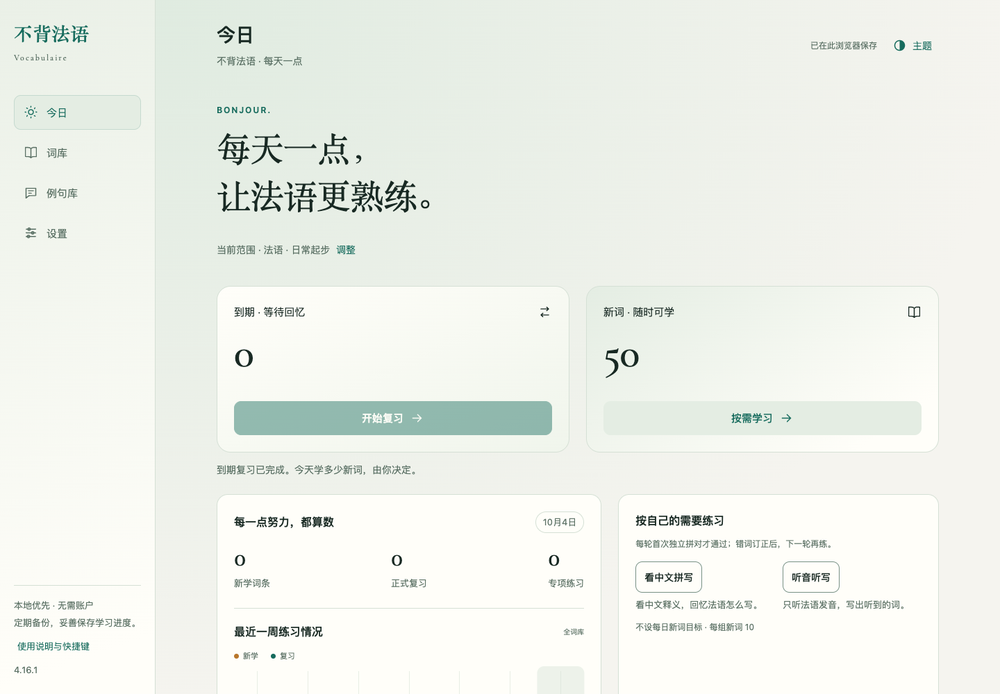

# 不背法语 · Vocabulaire

众所周知，不背单词是一款非常好用的英语背单词 app，其简洁优雅的 UI 设计、科学高效的学习体系使得用户体验十分丝滑。

然而，我在学习法语时并没有找到设计得像不背单词这样好的法语背单词 app，于是自己借助 Codex 手搓了这样一个法语版不背单词网站。

这个网站的一大特色是所有内容完全放在一个 HTML 中，所有数据均存储在本地，无须注册、无须联网即可随时随地使用。

希望这个网站能帮你更加高效地记忆法语单词～

[](https://github.com/lingyunleo/bubei-French) [](CHANGELOG.md) [](PRIVACY.md) [](CONTRIBUTING.md) [](README.md) [](README.en.md)



## 快速上手

1. 下载最新版附件中的 HTML 文件 [不背法语-4.16.1.html](https://github.com/lingyunleo/bubei-French/releases/download/v4.16.1/bubei-French-4.16.1.html)。
2. 用 Google Chrome、Safari、Microsoft Edge、Firefox 等常见浏览器打开该文件。
3. 跟随入门引导体验相关功能、完成个性化设置，之后就可以开始学习啦～

## 功能介绍

- 按组学习新词，使用 FSRS 安排复习，并练习拼写、听写和错词。
- 管理多个词表，支持导入 Excel、CSV、TSV，也可以直接粘贴表格文本。
- 支持导入例句与译文，使用浏览器合成朗读，或添加有使用权限的录音。
- 界面语言可选择中文、英文或法文；提供 CLASSIQUE、ATELIER、VERDURE 三种风格及各自的浅色、深色外观。
- 支持导出词表、完整学习备份或携带当前资料的便携 HTML。

入门内容包括 50 个常用词和 100 条例句。其中 99 条项目自编例句使用合成朗读，另有 1 条带来源与许可的内置真人短句。它们是入门示例，仅用于功能体验。

## 导入词表

在词库中打开“导入词表”，选择整理好的文件，或粘贴表格内容。先检查预览中的词条、释义与提示，再确认导入。

法语助手导出的原始 CSV 可以直接导入，但直接导入只提取首义，不会自动生成完整用法或例句。

页面提供让 AI 来完成整理的提示词，可以直接把该提示词与词表文件（可以是图片、表格、PDF等常见格式）喂给 AI，让 AI 整理出可导入的文件。不过仍需自行核对 AI 生成的结果。

可以先试用 [三词 TSV 示例](examples/入门示例.tsv) 来体验导入功能。

导入文件支持 `.xlsx`、`.xls`、`.ods`、`.csv`、`.tsv` 和 `.txt` 格式。通常建议使用含“法语”“中文”等表头的 TSV，便于保留制表符分隔的长释义和例句。词表文件上限为 12 MB。

## 保存、备份与升级

正常情况下，词表、进度、设置和已导入音频保存在当前浏览器中。它们不会自动写回原 HTML，也不会自动同步到其他设备。如果页面提示无法持久保存，请及时导出备份。

使用 **设置 → 数据与备份 → 备份到文件** 导出完整备份。换设备、换浏览器、移动文件、升级版本或清理浏览器之前，建议先完成这一步。

升级时先在旧文件中导出备份，再打开新版，通过“从备份恢复”检查内容并确认。**恢复会替换目标页面的词库与进度，不会自动合并两份存档。** 普通 CSV/TSV 词表不包含完整学习进度，不能代替 JSON 备份。

浏览器对本地文件的存储隔离方式可能不同；文件改名或移动后，看不到旧数据不一定表示数据已被删除。可以回到原文件位置、原浏览器导出备份，再迁移到新版。

由“导出便携 HTML”生成的文件，以及完整 JSON 备份，可能包含你的词表、笔记、学习记录和录音，应按个人资料保管。详见 [隐私说明](PRIVACY.md)。

## 离线与声音

下载后的正式 HTML 可以离线打开并进行文字学习。内置真人样本和已经保存在本地的录音可离线播放。

浏览器合成朗读取决于设备、法语语音包、浏览器权限和所选声音；部分声音可能需要网络。尚未缓存的在线音频也需要网络，来源可能限制访问。因此，不保证离线时所有声音都可用。朗读失败时可检查法语声音设置、再次播放，或继续文字学习。

## 本地开发

需要 **Python 3.9+**、**Node.js 22+** 和 npm。首次使用按以下顺序执行：

```sh
git clone https://github.com/lingyunleo/bubei-French.git
cd bubei-French
npm ci
npx playwright install chromium webkit
npm run build
npm test
npm run test:browser
```

Linux 环境缺少系统浏览器依赖时，使用 `npx playwright install --with-deps chromium webkit`。

`npm run build` 调用 `scripts/build-release.py`，按 `release.json` 的版本生成根目录单 HTML。修改源码后重新构建；直接修改生成的 HTML 会在下一次构建时被覆盖。测试命令需要实际执行，文档中的命令不表示你的环境或某次提交已经通过检查。

```text
src/                       页面、样式、学习逻辑和本地依赖
src/vendor/                第三方库、许可及素材来源清单
tests/                     自动检查
scripts/build-release.py   正式单 HTML 构建入口
release.json               发布版本信息
不背法语-4.16.1.html         当前正式使用入口
LICENSE                    项目 MIT 许可
```

## 问题反馈与项目许可

一般问题可在 [Issues](https://github.com/lingyunleo/bubei-French/issues) 中说明版本、浏览器、复现步骤和预期结果。请使用删去个人资料的最小示例；安全问题按 [SECURITY.md](SECURITY.md) 处理。

项目自有代码与自编资源采用 [MIT 许可证](LICENSE)，Copyright (c) 2026 凌云_Léo。第三方软件、字体和真人音频保留各自许可，详见 [第三方与素材说明](src/vendor/THIRD_PARTY_NOTICES.md)。
